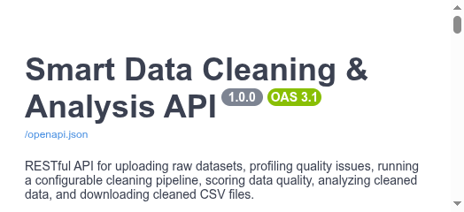
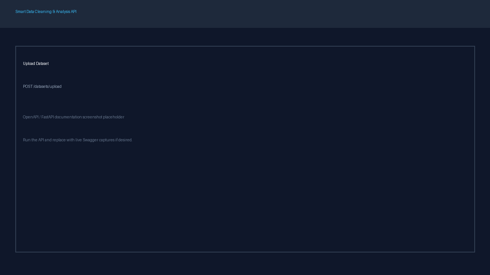
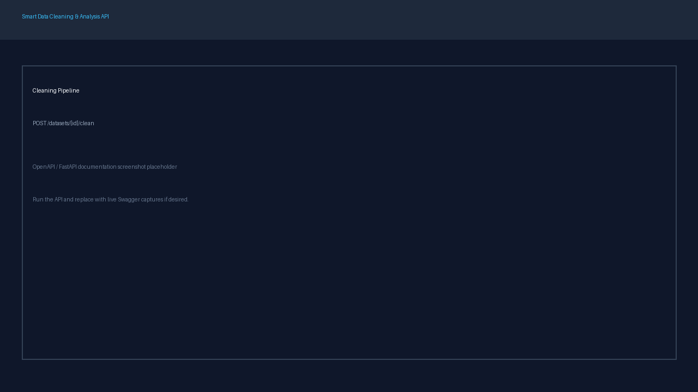
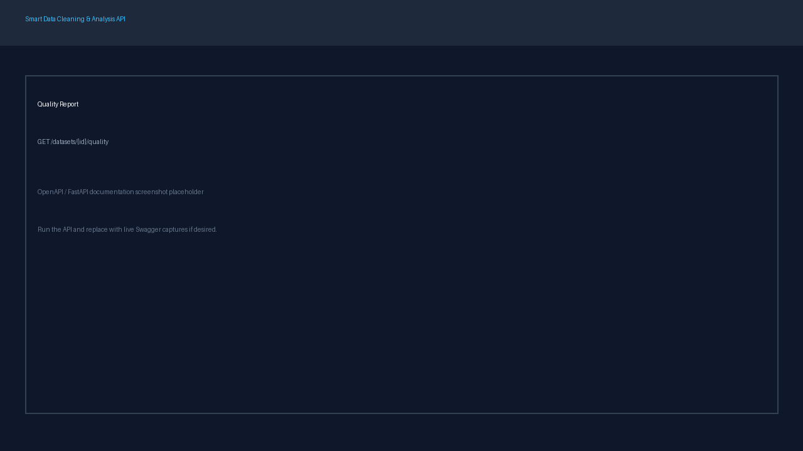

# Smart Data Cleaning & Analysis API

A production-style FastAPI service that turns messy CSV/Excel datasets into cleaned, scored, and analyzable data through a full processing pipeline:

```text
Upload → Validation → Profiling → Cleaning → Quality Assessment → Analysis → Download
```

## Project Overview

**Smart Data Cleaning & Analysis API** receives raw datasets with missing values, duplicates, inconsistent text, invalid values, and outliers. It validates files, persists metadata, profiles quality issues, runs a configurable cleaning pipeline, computes a 0–100 quality score, analyzes cleaned data, and exports a cleaned CSV.

## Problem Statement

Raw business/customer datasets often contain missing values, duplicate rows, inconsistent categories, invalid ages/emails, formatting errors, and outliers. Analyzing dirty data produces misleading results. This API provides an independent preprocessing service with persistence, standardized errors, tests, Docker support, and OpenAPI docs.

## Features

- CSV / XLSX / XLS upload with size, extension, and parse validation
- Dataset listing with pagination and detail lookup
- Column-level profiling (missing, uniqueness, numeric stats)
- Configuration-driven cleaning pipeline
- Missing-value strategies (median / mode by default)
- Duplicate removal, text normalization, invalid-value rules, IQR outlier detection
- Before/after quality report and quality score
- Numeric, categorical, and conditional business analysis
- Cleaned dataset download (CSV)
- Dataset deletion (DB + raw/cleaned files + cleaning history)
- SQLite persistence via SQLAlchemy
- Standardized error responses
- Swagger / OpenAPI at `/docs`
- Pytest suite (30+ tests)
- Docker + docker compose support

## Architecture

Layered backend with clear separation of concerns:

| Layer | Responsibility |
| --- | --- |
| API (`app/api`) | HTTP, validation, dependency injection |
| Services (`app/services`) | Profiling, cleaning, analysis, quality, files |
| Database (`app/database`) | SQLAlchemy models and sessions |
| Schemas (`app/schemas`) | Pydantic request/response contracts |
| Core (`app/core`) | Config, logging, exceptions |

## Project Structure

```text
smart-data-api/
├── app/
│   ├── main.py
│   ├── api/
│   ├── core/
│   ├── database/
│   ├── models/
│   ├── schemas/
│   ├── services/
│   └── utils/
├── tests/
├── sample_data/
│   └── customers_dirty.csv
├── storage/
│   ├── raw/
│   └── cleaned/
├── screenshots/
├── Dockerfile
├── docker-compose.yml
├── pyproject.toml
├── .env.example
├── README.md
├── README.fa.md
└── LICENSE
```

## Technologies

- Python 3.11+
- FastAPI + Uvicorn
- Pandas / NumPy
- Pydantic Settings
- SQLAlchemy + SQLite
- Pytest / httpx
- Docker
- openpyxl

## Installation

```bash
git clone <repository>
cd smart-data-cleaning-api

python -m venv .venv
source .venv/bin/activate   # Windows: .venv\Scripts\activate

pip install ".[dev]"
cp .env.example .env
```

## Running Locally

```bash
uvicorn app.main:app --reload
```

- API: http://localhost:8000
- Swagger: http://localhost:8000/docs
- Health: http://localhost:8000/health

## Running with Docker

```bash
touch smart_data.db
docker compose up --build
```

Then open http://localhost:8000/docs

## API Documentation

FastAPI generates interactive OpenAPI docs at `/docs` and `/redoc`, including request bodies, response schemas, status codes, and examples.

## API Endpoints

| Method | Endpoint | Purpose |
| --- | --- | --- |
| POST | `/datasets/upload` | Upload dataset |
| GET | `/datasets` | List datasets |
| GET | `/datasets/{id}` | Dataset details |
| GET | `/datasets/{id}/profile` | Profiling |
| POST | `/datasets/{id}/clean` | Run cleaning |
| GET | `/datasets/{id}/quality` | Quality report |
| GET | `/datasets/{id}/analysis` | Analysis |
| GET | `/datasets/{id}/download` | Download cleaned CSV |
| DELETE | `/datasets/{id}` | Delete dataset |
| GET | `/datasets/{id}/cleaning-history` | Cleaning audit log |

## Example Workflow

### Step 1 — Upload

```bash
curl -X POST http://localhost:8000/datasets/upload \
  -F "file=@sample_data/customers_dirty.csv"
```

### Step 2 — Profile

```bash
curl http://localhost:8000/datasets/1/profile
```

### Step 3 — Clean

```bash
curl -X POST http://localhost:8000/datasets/1/clean \
  -H "Content-Type: application/json" \
  -d '{
    "remove_duplicates": true,
    "fill_missing": true,
    "normalize_text": true,
    "validate_values": true,
    "detect_outliers": true,
    "numeric_strategy": "median",
    "categorical_strategy": "mode"
  }'
```

### Step 4 — Quality

```bash
curl http://localhost:8000/datasets/1/quality
```

### Step 5 — Analysis

```bash
curl http://localhost:8000/datasets/1/analysis
```

### Step 6 — Download

```bash
curl -OJ http://localhost:8000/datasets/1/download
```

## Data Cleaning Strategy

Pipeline order:

1. Load dataset / schema detection
2. Missing value handling (numeric → median, categorical → mode)
3. Duplicate removal
4. Text normalization (trim, collapse spaces, case canonicalization) — skips email/id/date columns
5. Invalid value detection (age 0–120, quantity/price ≥ 0, email format, dates)
6. Outlier detection via IQR (`Q1 - 1.5×IQR`, `Q3 + 1.5×IQR`)
7. Save cleaned CSV + quality summary

**Design decision:** outliers are **reported, not deleted** in v1 so analysts can decide how to treat them.

Completely empty columns are reported and not auto-deleted.

Original files are preserved under `storage/raw/`; cleaned files go to `storage/cleaned/`.

## Data Quality Score

Final score (clamped to 0–100):

```text
30% Missing Score
+ 25% Duplicate Score
+ 25% Invalid Value Score
+ 20% Consistency Score
```

| Score | Interpretation |
| --- | --- |
| 90–100 | Excellent |
| 75–89 | Good |
| 60–74 | Fair |
| 40–59 | Poor |
| 0–39 | Critical |

## Sample Dataset

`sample_data/customers_dirty.csv` (~800 rows) includes:

- Columns: `customer_id`, `name`, `email`, `age`, `city`, `region`, `product`, `quantity`, `unit_price`, `total_sales`, `date`
- Missing values, duplicates, inconsistent city casing, invalid ages/emails/quantities, outliers, mixed date formats

## Testing

```bash
pytest -q
pytest --cov=app --cov-report=term-missing
```

Coverage includes upload, validation, profiling, cleaning, quality, analysis, download, database persistence, and API error contracts.

## Screenshots











## Error Handling

Standard error body:

```json
{
  "error": {
    "code": "DATASET_NOT_FOUND",
    "message": "Dataset with id 101 was not found."
  }
}
```

Codes include `INVALID_FILE_TYPE`, `FILE_TOO_LARGE`, `EMPTY_FILE`, `INVALID_DATASET`, `DATASET_NOT_FOUND`, `DATASET_NOT_CLEANED`, `PROCESSING_ERROR`, `INVALID_CLEANING_CONFIGURATION`.

Internal stack traces are not returned to clients.

## Future Improvements

- JWT / OAuth2 authentication
- PostgreSQL for production
- Celery/Redis background jobs for large files
- S3-compatible storage
- Advanced profiling (correlation, distributions)
- Visualization dashboard
- Custom cleaning rules API
- Schema validation contracts
- ML-based anomaly detection
- Dataset versioning

## Persian Documentation

مستند کامل فارسی پروژه:

- [README.fa.md](README.fa.md)

## License

MIT — see [LICENSE](LICENSE).
